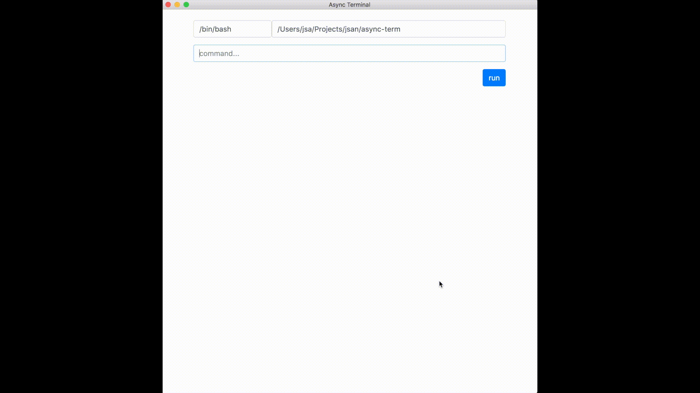

# Asyncronus terminal UI

I'm human, I don't want to wait for run to be done before typing my next command.



## install

```sh
$ sudo npm install -g async-term
$ async-term
```

## Goal:

- async terminal
- emulated terminal
- simple UI
- little more features than classic terminal

### disclaimer:

this is a proof of concept / test / code playground; some stuff could be not fully functionnal

## TODO
- env vars
- input when read from stdin
- support textarea for multiline command
- icon
- button to show man page
- completition
